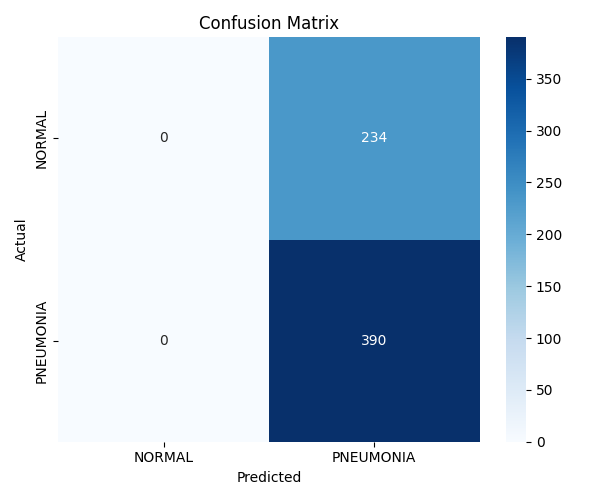
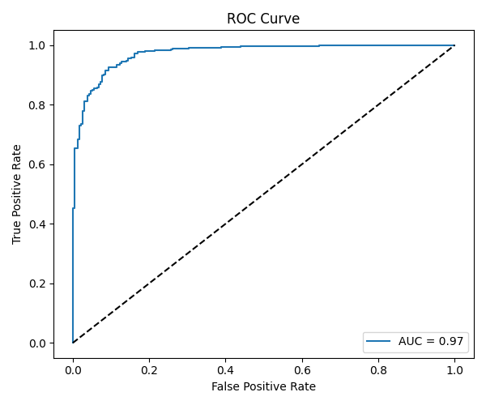

#  Chest X-Ray Pneumonia Detection using Deep Learning

##  Problem Statement
Pneumonia is a life-threatening disease. Early and accurate detection 
from chest X-rays can save lives. This project automates that detection 
using deep learning with DenseNet121 transfer learning.

##  Results
| Metric | Score |
|--------|-------|
| Accuracy | 91% |
| ROC-AUC | 97.32% |
| Precision (Pneumonia) | 95% |
| Recall (Pneumonia) | 91% |

##  Dataset
- **Source:** [Kaggle - Chest X-Ray Images](https://www.kaggle.com/datasets/paultimothymooney/chest-xray-pneumonia)
- **Classes:** NORMAL vs PNEUMONIA
- **Size:** 5,216 training images

##  Tech Stack
- Python 3.x
- TensorFlow / Keras
- DenseNet121 (Transfer Learning)
- OpenCV, Matplotlib, Seaborn
- Scikit-learn

##  Project Structure
chest-xray-pneumonia/
├── src/
│   ├── preprocess.py
│   ├── model.py
│   ├── train.py
│   └── evaluate.py
├── results/
│   ├── confusion_matrix.png
│   └── roc_curve.png
├── main.py
├── requirements.txt
└── README.md

##  How to Run

### 1. Clone the repo
git clone https://github.com/LakshmiSangari/chest-xray-pneumonia.git
cd chest-xray-pneumonia

### 2. Install dependencies
pip install -r requirements.txt

### 3. Download dataset
kaggle datasets download -d paultimothymooney/chest-xray-pneumonia
unzip chest-xray-pneumonia.zip

### 4. Run
python main.py

##  Visualizations

### Confusion Matrix

### ROC Curve

## 👤 Author
LakshmiSangari - [GitHub](https://github.com/LakshmiSangari)
